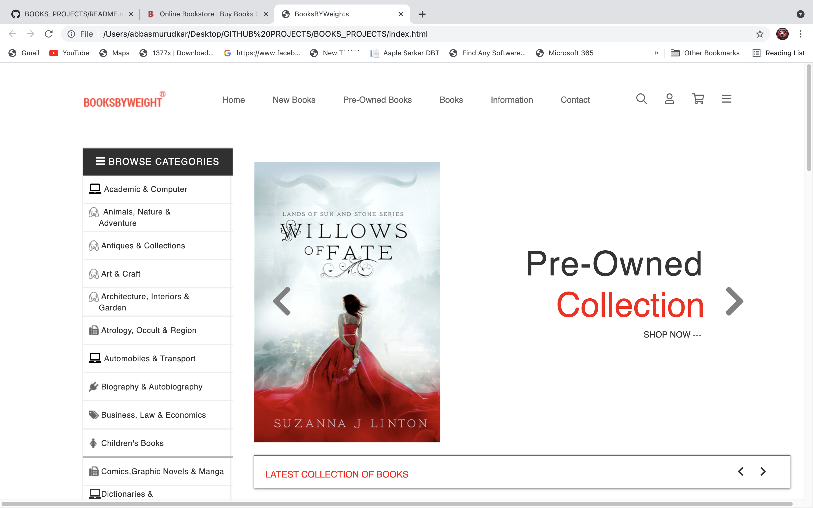

<h2 align="center">BOOKS PROJECT </h2>

  
<i>
  A book is a medium for recording information in the form of writing or images, typically composed of many pages bound together and protected by a cover. The technical term for this physical arrangement is codex.
  </i> 
<a href="https://www.bookswagon.com/">www.bookswagon.com</a> 

<h2>BOOKS-Clone Project:</h2>
This is a simple clone of webpage tourist.com using HTML, CSS and javascript. Check out the page at
https://github.com/abbasmurudkar/BOOKS_PROJECT
<h2>page_facing_up: How to use:</h2>
<ol>
  <li>Download the ZIP file</li>
  <li>Extraxt from any ZIP Extracter</li>
  <li>Open `index.html` in any Browser</li>
  </ol>
  ## :camera: Screenshot:

    ## :octocat: Credits:

- ABBAS MURUDKAR (https://www.linkedin.com/in/abbas-murudkar-0084391ba/)
- ## :memo: Disclaimer:-

**_Note: This Books clone project is just for educational purpose._**

